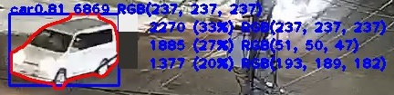
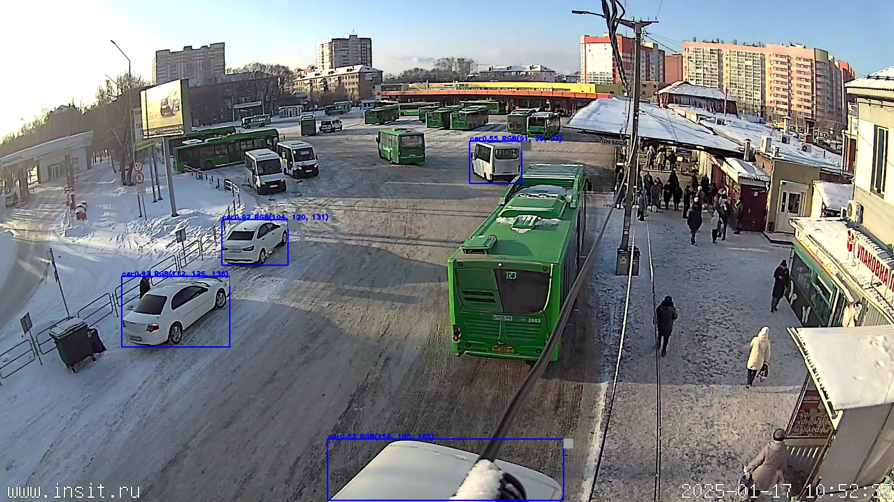
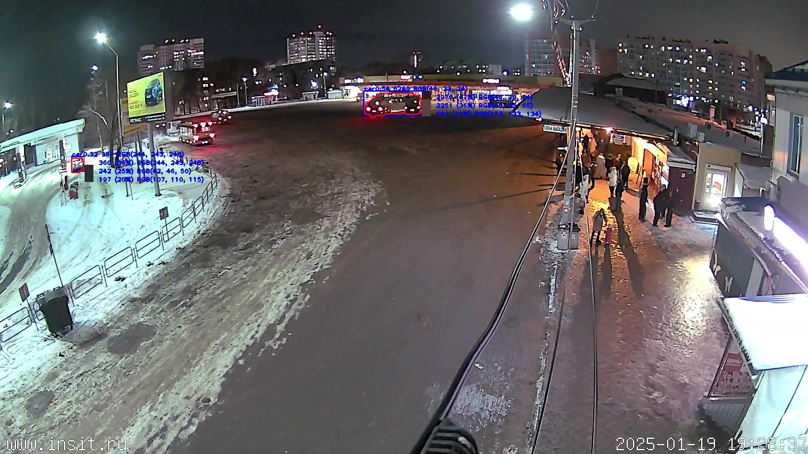
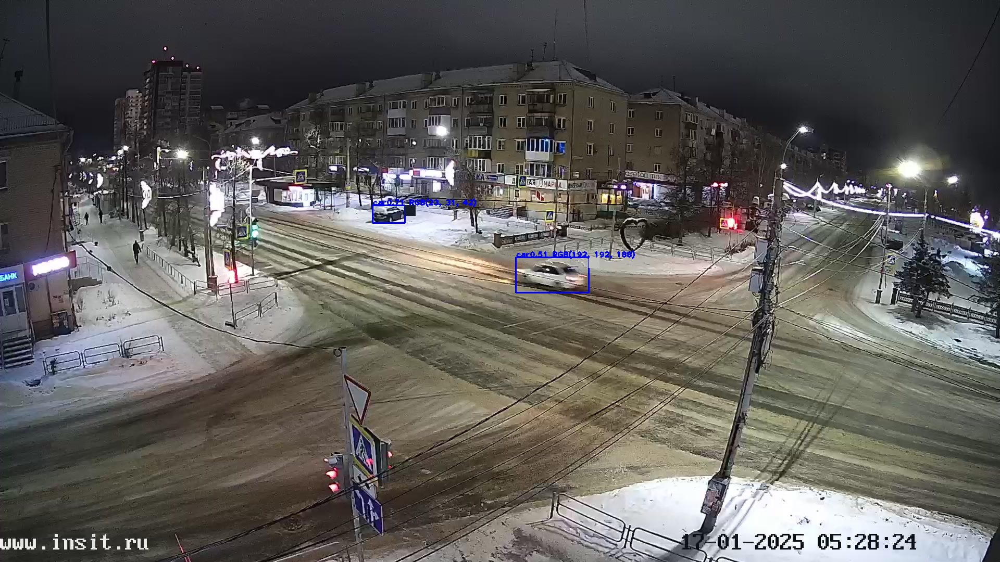
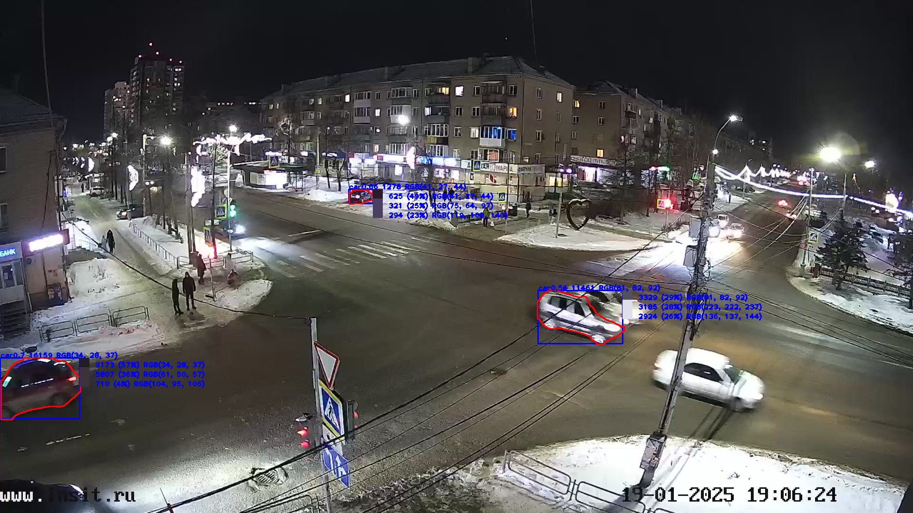
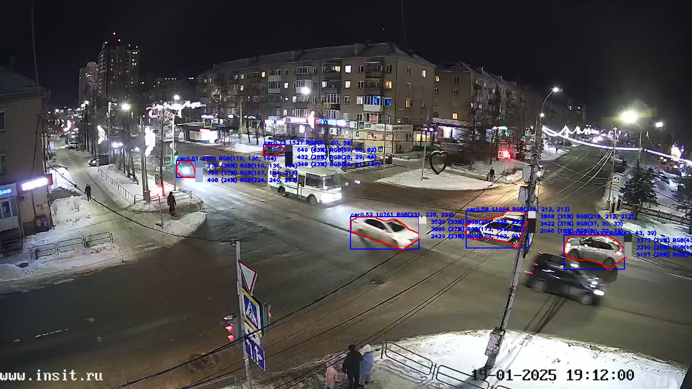

За основу задания взята работа, выполненная во время учёбы (так называемый "проект").

В ходе выполнения задания использовался chatGPT.

Решена задача о сбору информации с общедоступных вэб-камер и распознаванию объектов на них (в частности - автомобилей) с направлением результатов в телеграмм.

Код запущен на виртуальном сервере, результаты доступны через бот @calc_people_camera_u_bot (при обращении в базе фиксируется уникальный номер обратившегося). Для получения последних фото с результатами анализа необходимо ввести *.

Т.к. проект "учебный" / "тестовый" все пароли, токенты размещены в исходном коде (что не хорошо, но позволяет поверяющему ознакомиться с результатами более детально).

Описание каталогов репозитория:
- base - скрипты по созданию и минимальному наплнению базы;
- example_picture - результаты идентификации;
- server - скрипты.

Описание алгоритма:
1.	С заданной периодичностью (параметр «Периодичность опроса – сек» в таблице public.calc_people_camera_param), скрипт (CalculatePeople.py) опрашивает камеры (внесеные в таблицу calc_people_camera), то есть делает запросы и копирует последнюю картинку с камеры на диск. Т.е. это не видео-поток, а именно камеры, которые позволяю с помощью htm-запроса забрать последнюю "картинку" с камеры (на момент выполнения запроса).
2.	По загруженным картинкам рассчитывается количество объектов (вид объекта для поиска задаётся id_class_yolo_coco задаётся в таблице таблицы calc_people_camera и соотсетствует id объекта, котрый идентифицирует модель Yolo). Для автомобилей (код 2) оценивается цвет (функция find_people в модуле CalculatePeople.py). Цвет в формате RGB и прямоугольник с определённым цветов выводится непосредственно на изображение.
Результаты фиксируются в таблице calc_people_camera_cnt_people. При «пересечении» определённых значений пользователю высылается сообщение в телеграмм – это не входит в задачу.
Для идентификации объектов используешься модель YOLO('yolov8x-seg.pt') - позволяет очерчивать контуры объектов.

Алгоритм оценки цвета:

2.1	Определяем область, в котором обнаружен объект.

2.2	«Сглаживаем» цвета на изображении (убираем точки и др. дефекты).

2.3	Выполняем кластеризацию точек по 4 классам. Класс с наибольшим числом точек – цвет, который мы ищем.

2.4	Результат - «усреднённый» цвет точек из кластера с максимальным числом точек.

Проблемы такого алгоритма определения цвета:

- часто максимальное число точек приходится на область со «стеклом»;
  
- автомобили часто грязные – цвет соответствующий.
 
Модули CalculatePeople_telegram.py, CalculatePeople_telegram_function.py обеспечивают работу с telegram. 

CalculatePeople_run.sh и CalculatePeople_telegram_run.sh нужны для запуска через pm2.

Информация по "распознаванию" автомобиля и его цвета отображается непосредственно на картинке:

Расшифровка подписик объекту:
- 0.81 - вероятность с которой объек относится к автомобилю;
- 6869 - количество точек объекта (в красной границе);
- RGB(237, 237, 237) - основной цвет кластера;
- 
Справа от каждого объекта указывается 3 цвета (центры кластеров) с наибольшим числом точек, например, второй по счёту цвет:
- 1885 - точек относится к кластеру;
- 27% - % точек, относящихся к этому кластеру (1885 / 6869);
- RGB (51, 50, 47) - основной цвет кластера.

Удачная идентификация:

Неоднозначная идентификация:

